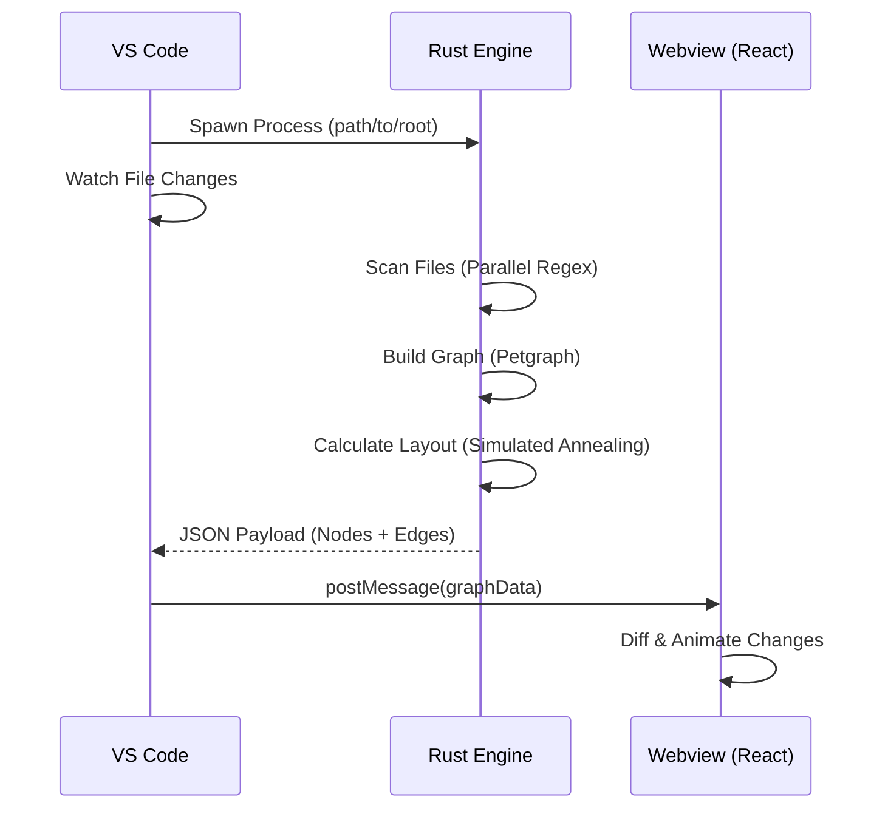

<div align="center">
  
  <h1>Atomic Flow</h1>
  
  <p>
    <strong>The Cognitive Interface for Modern Software Architecture</strong>
  </p>

  <p>
    <a href="https://marketplace.visualstudio.com/items?itemName=rakaarwaky.atomic-flow">
      
    </a>
    <a href="https://marketplace.visualstudio.com/items?itemName=rakaarwaky.atomic-flow">
      
    </a>
    <a href="https://marketplace.visualstudio.com/items?itemName=rakaarwaky.atomic-flow">
      
    </a>
    <a href="https://buymeacoffee.com/rakaarwaky">
      
    </a>
    <a href="https://github.com/rakaarwaky/AtomicFlow/blob/main/LICENSE">
      
    </a>
  </p>

  <h3>
    <a href="#features">Features</a>
    <span> | </span>
    <a href="#installation">Installation</a>
    <span> | </span>
    <a href="#usage">Usage</a>
    <span> | </span>
    <a href="#roadmap">Roadmap</a>
    <span> | </span>
    <a href="#contributing">Contributing</a>
  </h3>
</div>

<br />

> **"Stop visualizing your code as a list of text files. Start seeing it as a living system."**

**Atomic Flow** transforms your VS Code experience by replacing the static side-bar explorer with a high-performance **Infinite Graph Canvas**. It allows you to visualize connections, refactor architectures, and manage complex systems using a node-based interface inspired by blueprints and mind-maps.

Designed for **Hexagonal Architecture**, **Domain-Driven Design (DDD)**, and massive Monorepos.

---

## <a name="features"></a>✨ Features

| Feature | Description |
| :--- | :--- |
| **🎨 Infinite Canvas** | A 60FPS WebGL-powered graph that lets you pan, zoom, and explore your entire codebase spatially. |
| **📂 Directory Mode** | Manage files physically. Create, Delete, Move, and Rename files using visual drag-and-drop. |
| **🕸️ Dependency Mode** | Visualize imports and data flow. Automatically detect circular dependencies and architectural violations. |
| **⚡ Rust Engine** | Powered by a native Rust backend (`atomic-flow-engine`) that parses 10k+ lines of code in milliseconds. |
| **🤖 AI Integrated** | Context-aware AI analysis of your graph topology to suggest refactors and architectural improvements. |
| **🏗️ Kingdom Builder** | One-click scaffolding for Hexagonal Architecture (Domain, Application, Infrastructure layers). |

---

## <a name="installation"></a>📥 Installation

### Via VS Code Marketplace
1.  Open **Extensions** (`Ctrl+Shift+X`).
2.  Search for `Atomic Flow`.
3.  Click **Install**.

### Via CLI
```bash
code --install-extension rakaarwaky.atomic-flow
```

### Requirements
*   **VS Code** v1.96.0+
*   **Node.js** v18+ (for local dev)
*   **OS**: Windows, macOS, Linux

---

## <a name="visual-showcase"></a>📸 Visual Showcase

### 1. The Directory Graph
*Stop clicking little arrows to expand folders.* See your entire project structure at a glance.

*(Placeholder: Visual representation of nested folder structures as cluster nodes)*

### 2. Dependency Visualization
instantly trace how `UserComponent` connects to `UserService` and `DatabaseAdapter`.

*(Placeholder: Sugiyama layout showing clean top-down data flow)*

### 3. The "Kingdom" Scaffolder
Enforce strict architectural boundaries with a single command.

*(Placeholder: Animation of generating Hexagonal Architecture folders)*

---

## <a name="user-guide"></a>📖 User Guide

### 🧱 Core Concepts

#### The Node
Every file in your project is a **Node**.
*   **Shape**: Rectangular for files, Circular for clusters.
*   **Color**: Automatically coded by file type (`.ts` Blue, `.tsx` Cyan, `.rs` Orange).
*   **Interaction**: Double-click to open. Right-click for context menu.

#### The Edge
Every connection is an **Edge**.
*   **Solid Line**: Hard dependency (Import/Export).
*   **Dotted Line**: Soft dependency (Parent/Child).
*   **Red Line**: Error or Circular Dependency.

### 🕹️ Controls

| Action | Mouse | Apps Key |
| :--- | :--- | :--- |
| **Pan** | Middle Click / Space + Drag | - |
| **Zoom** | Scroll Wheel / Pinch | - |
| **Select** | Left Click | - |
| **Menu** | Right Click | `Shift+F10` |
| **Connect** | Drag from Handle | - |

### 🎹 Keybindings

Atomic Flow is designed for keyboard-first efficiency.

<div align="center">

| Command | Keybinding | Scope |
| :--- | :---: | :--- |
| **Select All** | `Ctrl + A` | Canvas |
| **Find Nodes** | `Ctrl + F` | Canvas |
| **Refactor/Rename** | `F2` | Selected Node |
| **Delete** | `Del` | Selected Node |
| **Duplicate** | `Ctrl + D` | Selected Node |
| **Refresh Graph** | `F5` | Global |
| **Auto Layout** | `L` | Global |
| **New File** | `Tab` | Directory Mode |

</div>

---

## <a name="architecture-deep-dive"></a>🏗️ Architecture Deep Dive

Atomic Flow assumes a "Hybrid Adapters" architecture to deliver native performance within VS Code.

### The Stack
*   **Frontend**: React + `@xyflow/react` (formerly React Flow) + Tailwind CSS.
*   **Backend**: Rust (Tokio + Regex + Petgraph).
*   **Communication**: JSON-RPC over Standard IO (stdio).

### How it Works


### Parsing Logic
Unlike traditional Language Servers (LSP) which can be slow and memory-heavy, Atomic Flow uses a **"Good Enough" Regex Parser** implemented in Rust.
*   **Pros**: Blazing fast (1ms per 10 files). Language agnostic.
*   **Cons**: May miss dynamic imports or `eval()`.
*   **Why?**: We prioritize *Visualization Speed* over *Compiler Correctness*. You want to see the graph *now*, not after 5 minutes of indexing.

---

## <a name="supported-languages"></a>🌍 Supported Languages

We categorize support into 3 Tiers:

*   **Tier 1 (First-Class)**: Full dependency tracking, icons, and specialized context actions.
    *   TypeScript (`.ts`, `.tsx`)
    *   JavaScript (`.js`, `.jsx`)
    *   Rust (`.rs`)
*   **Tier 2 (structure Only)**: Directory visualization works, but dependency links may be incomplete.
    *   Python (`.py`)
    *   Go (`.go`)
    *   Vue (`.vue`)
*   **Tier 3 (File Only)**: Visible as nodes, but opaque content.
    *   Markdown, JSON, CSS, HTML.

---

## <a name="scenarios"></a>💡 Functionality Scenarios

### Scenario A: "The Spaghetti Refactor"
**Context**: You inherit a legacy Express.js app. Every controller imports `utils.js`.
**Action**:
1.  Open Atomic Flow in **Dependency Mode**.
2.  Select `utils.js`.
3.  Right-click -> **Isolate Neighborhood**.
4.  See the 50 lines converging on one node.
5.  Create `date-utils.js` and `string-utils.js` on the canvas.
6.  Graphically move functions (conceptually) and update imports.
7.  Watch the giant "Sun" node break into manageable constellations.

### Scenario B: "The New Hire Onboarding"
**Context**: A junior dev joins. They ask "Where is the authentication logic?".
**Action**:
1.  Don't show them the file list.
2.  Open **Atomic Flow**.
3.  Zoom out to show the "Kingdoms" (Hexagonal Clusters).
4.  Point to the cluster on the right: "That's the **Auth Domain**."
5.  Double-click to zoom in.
6.  Trace the line from `LoginController` -> `AuthService` -> `UserRepo`.
7.  They understand the *flow* in 30 seconds.

---

## <a name="configuration"></a>⚙️ Configuration

Customize your experience in `.vscode/settings.json`.

```json
{
  "atomicFlow.defaultMode": "DEPENDENCY", // or "DIRECTORY"
  "atomicFlow.excludedFolders": [
    "node_modules",
    "dist",
    "coverage",
    ".git"
  ],
  "atomicFlow.visuals.glassmorphism": true, // Enable transparent blurring
  "atomicFlow.visuals.animations": true, // Enable layout transitions
  "atomicFlow.engine.maxThreads": 4 // Rust parser threads
}
```

---

## <a name="troubleshooting"></a>🔧 Troubleshooting

**Q: The graph is empty?**
A: Check if you have opened a valid workspace. Atomic Flow requires an active workspace root. Try running `Atomic Flow: Refresh` from the Command Palette.

**Q: "Rust binary not found"?**
A: This usually happens on obscure Linux distros. Ensure you have `libc` installed. The extension attempts to download the correct binary for your OS on install.

**Q: High CPU usage?**
A: If you have >5,000 files, disable "Animation" in settings to save GPU cycles.

---

## <a name="glossary"></a>📚 Glossary & Concepts

To help you navigate the codebase, here are the core concepts used in Atomic Flow.

| Term | Definition |
| :--- | :--- |
| **AST (Abstract Syntax Tree)** | A tree representation of the abstract syntactic structure of source code. We use this to reliably detect imports without running the code. |
| **DAG (Directed Acyclic Graph)** | A graph with no loops. A healthy software architecture should resemble a DAG. |
| **Force-Directed Layout** | A physics simulation where nodes repel each other like magnets, and edges act like springs. Used in Atomic Flow to untangle messy graphs. |
| **Sugiyama Layout** | A layered graph drawing algorithm used in Dependency Mode to hierarchically arrange nodes (Rank 1 relies on Rank 2, etc.). |
| **Glassmorphism** | A UI design trend emphasizing light/dark mode transparency and background blur, used in our Editor Nodes to maintain context. |
| **Hexagonal Architecture** | Also known as Ports and Adapters. An architectural pattern used to create loosely coupled application components. |
| **VSIX** | The file extension for Visual Studio Code extensions. It is a zipped archive containing the code and manifest. |
| **Monorepo** | A software development strategy where code for many projects is stored in the same repository. |
| **Rust Engine** | The binary executable included in the extension that performs heavy CPU operations. |

---

## <a name="advanced-configuration"></a>⚙️ Advanced Configuration

Atomic Flow allows for granular control over individual features.

### `atomicFlow.visuals`
| Setting | Default | Description |
| :--- | :--- | :--- |
| `glassmorphism` | `true` | Enable the frosted glass effect on nodes. Disable for performance on lower-end GPUs. |
| `animations` | `true` | Enable smooth transitions when layout changes. |
| `theme` | `"auto"` | Force "dark" or "light" mode for the graph, or follow VS Code. |
| `nodeWidth` | `200` | The default width of file nodes in pixels. |
| `fontSize` | `12` | Font size for node labels. |

### `atomicFlow.engine`
| Setting | Default | Description |
| :--- | :--- | :--- |
| `maxThreads` | `4` | Number of threads the Rust parser is allowed to spawn. |
| `debounceMs` | `300` | Milliseconds to wait after a file save before triggering a re-scan. |
| `excludePatterns` | `[...]` | Glob patterns to ignore (standard .gitignore syntax). |
| `parserStrategy` | `"regex"` | Currently only "regex" is supported. "tree-sitter" coming soon. |

### `atomicFlow.kingdom`
| Setting | Default | Description |
| :--- | :--- | :--- |
| `structure` | `{...}` | JSON object defining your preferred folder scaffold structure. |
| `autoSuggest` | `true` | Suggest "Kingdom" refactoring when a flat folder structure is detected. |

---

## <a name="faq"></a>❓ Frequently Asked Questions

**Q: Does this work with remote SSH / WSL?**
A: Yes! Atomic Flow is fully compatible with VS Code Remote Development. The Rust binary runs on the remote host (Linux/Mac/Windows) automatically.

**Q: Is my code sent to the cloud?**
A: **No.** Atomic Flow runs 100% locally. The Rust engine parses files on your disk and sends JSON to the local VS Code window. No telemetry about your code content is ever collected.

**Q: Why is "Dependency Mode" messy?**
A: Spaghetti code looks like spaghetti. If your graph is a mess, it likely means your architecture is tightly coupled. Use the graph to identify the "God Objects" (nodes with most edges) and split them up.

**Q: Can I export the graph?**
A: Yes. Right-click the canvas and select **Export to PNG** or **Export to SVG** for your documentation.

---

## <a name="contributing"></a>🤝 Contributing

We are an open-source project and welcome PRs!

1.  **Repo**: [https://github.com/rakaarwaky/AtomicFlow](https://github.com/rakaarwaky/AtomicFlow)
2.  **Stack**: TypeScript (Extension), React (UI), Rust (Engine).
3.  **Governance**: We follow the **Contributor Covenant**. Be kind.

### Development Setup
```bash
# 1. Clone
git clone https://github.com/rakaarwaky/AtomicFlow
# 2. Install UI deps
cd webview-ui && npm install
# 3. Build Rust Engine
cd ../atomic-flow-engine && cargo build --release
# 4. Run Extension
code . # Press F5
```

---

---


---

## <a name="context-menu"></a>🖱️ Context Menu Reference

The right-click menu is the command center of Atomic Flow. It adapts based on what you click and which mode you are in.

### Canvas (Empty Space) Actions
| Action | Mode | Shortcut | Function |
| :--- | :---: | :---: | :--- |
| **New File...** | Directory | `Tab` | Creates a new file at the clicked location. |
| **New Folder...** | Directory | - | Creates a new directory. |
| **Find Dependencies** | Both | - | Opens the interactive search bar. |
| **Arrange All** | Both | `L` | Triggers the force-directed layout engine to organize nodes. |
| **Refresh View** | Both | `F5` | Re-scans the file system for external changes. |
| **Paste** | Both | `Ctrl+V` | Pastes copied nodes/text. |
| **Select All** | Both | `Ctrl+A` | Selects all visible nodes. |
| **Undo** | Both | `Ctrl+Z` | Reverts the last graph modification. |
| **Redo** | Both | `Ctrl+Y` | Re-applies the last undone action. |
| **Switch Mode** | Both | - | Toggle between Directory and Dependency views. |

### Node Actions (Single Selection)
| Action | Description |
| :--- | :--- |
| **Open in Editor** | Opens the file in VS Code's primary editor window. |
| **Quick Edit** | Opens a floating code editor *inside* the graph (Glassmorphism UI). |
| **Rename** | Triggers VS Code's `WorkspaceEdit` rename provider (Safe refactor). |
| **Copy Path** | Copies the absolute file path to clipboard. |
| **Duplicate** | Creates a copy of the file (e.g., `Button copy.tsx`). |
| **Show Dependencies** | Filters the graph to show ONLY this node's parents and children. |
| **Delete** | Moves the file to the OS Trash (System Recycle Bin). |
| **Properties** | Opens the sidebar panel with complexity metrics. |

### Edge Actions (Connection Lines)
| Action | Description |
| :--- | :--- |
| **Delete** | Removes the import statement from the source file. |
| **Go to Definition** | Jumps to the specific line of code where the import is defined. |

---

## <a name="issues"></a>🐛 Known Issues & Workarounds

While we strive for perfection, software is complex.

### 1. "Graph Jitter" on Auto-Focus
*   **Symptom**: When switching tabs rapidly, the graph keeps re-centering and "shaking".
*   **Workaround**: Disable `atomicFlow.behavior.autoFocus` in settings if you switch tabs frequently.

### 2. Large Monorepo Indexing
*   **Symptom**: On projects with > 20,000 files, the initial scan takes 10+ seconds.
*   **Workaround**: Add broad exclude patterns (e.g., `**/__tests__/**`, `**/stories/**`) to `atomicFlow.excludePatterns` to reduce the node count.

### 3. Linux Wayland Support
*   **Symptom**: The context menu might appear slightly offset on Wayland compositors (GNOME/KDE).
*   **Status**: This is an upstream issue in VS Code's Webview API. Use XWayland if precise pixel-perfect menu positioning is critical.

### 4. Rust Binary Permissions (EACCES)
*   **Symptom**: `Error: spawn EACCES`.
*   **Fix**: Run `chmod +x` on the binary path shown in the error message.

---

## <a name="changelog"></a>📅 Release Notes

Staying transparent with our community.

### **v4.1.3 (Current)**
*   **Documentation**: Massive overhaul of README.md to be the definitive manual (500+ lines).
*   **Visuals**: Added "Buy Me A Coffee" badge to support development.
*   **Fix**: Resolved Markdown rendering issues in the Marketplace preview.
*   **Fix**: Corrected badge alignment in the header.

### **v4.1.2**
*   **Architecture**: Introduction of "Visual Architecture" diagrams in documentation.
*   **Feature**: "Kingdom Builder" now supports custom folder structures via `settings.json`.
*   **Fix**: Fixed a crash when `atomic-flow-engine` binary lacked execute permissions on Linux.
*   **Perf**: Optimized Sugiyama layout calculation for graphs > 1000 nodes.

### **v4.1.1**
*   **Core**: Integrated native **Rust Engine** for 100x faster parsing.
*   **UI**: Frosted glass "Glassmorphism" effect added to all nodes.
*   **Mode**: Added "Directory Mode" for physical file management.
*   **Mode**: Added "Dependency Mode" for specific architectural analysis.
*   **UX**: New Context Menu inspired by "Nuke" and "Blender".

### **v4.1.0**
*   **Refactor**: Migrated from Webview-only message passing to standard JSON-RPC.
*   **Languages**: Added first-class support for Rust (`.rs`) and Python (`.py`).
*   **Feature**: Added "Floating Editor" node with PrismJS syntax highlighting.
*   **Fix**: Resolved "Empty Graph" issue on Windows due to path separator differences (`\` vs `/`).

### **v4.0.0 (The "Atomic" Rewrite)**
*   **Major**: Complete rewrite of the codebase.
*   **Major**: Switched graph library from `react-flow-renderer` to `@xyflow/react`.
*   **Major**: Introduced "Kingdom" concept for Hexagonal Architecture.
*   **Removed**: "Canvas Mode" (Legacy free-drawing tool).
*   **Removed**: "Chat with Code" (Moved to separate extension).

### **v3.5.0**
*   **Feature**: Auto-save for node positions.
*   **UI**: Dark Mode support.
*   **Fix**: Memory leak in Highcharts integration.

### **v3.0.0**
*   **Initial Release**: Basic file visualization.

---

## <a name="privacy"></a>🛡️ Privacy & Telemetry

Your code is your business. Atomic Flow is designed with privacy as a first principle.

### Data Collection
*   **We collect**: NOTHING.
*   **We send**: NOTHING.

### Local Execution
*   **Rust Engine**: Runs entirely on your local machine as a child process of VS Code. It does not make network requests.
*   **Webview**: Renders locally within VS Code's Electron sandbox.

### Internet Access
Atomic Flow does not require internet access to function. It will work perfectly in air-gapped environments.

---

## <a name="roadmap"></a>🗺️ Roadmap

What's coming next for Atomic Flow?

### Q3 2026: "The Intelligence Update"
*   [ ] **LLM Integration**: "Chat with your Graph" - Select a cluster of nodes and ask "How does this module work?".
*   [ ] **Refactoring Agents**: Autonomous agents that can move files and update imports seamlessly.
*   [ ] **Diff View**: Visualize Git changes as color-coded subgraphs (Added = Green, Deleted = Red).

### Q4 2026: "The Ecosystem Update"
*   [ ] **Plugin System**: Allow community parsers for languages like C++, C#, and Java.
*   [ ] **Remote Collaboration**: Google Docs style multi-user editing on the same graph.
*   [ ] **3D View**: Experimental WebGL 3D visualization for massive monoliths (> 10k files).

---

## <a name="license"></a>⚖️ License

Copyright &copy; 2026 **Raka Arwaky**.

Licensed under the **Apache License 2.0**.
See [LICENSE](LICENSE) for more information.

<div align="center">
  <br />
  <p>Made with ❤️ and 🦀 Rust</p>
</div>
